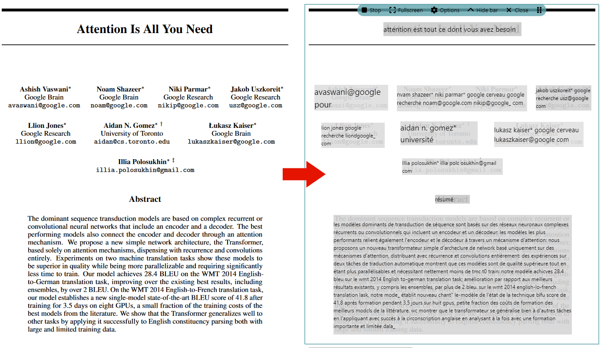

<h1 align="center">
  Live Desktop Translator
</h1>


<p align="center">
  Proof of concept for a desktop application that translates on-screen elements based on optical character recognition (OCR).
</p>

<div align="center">

[](https://opensource.org/licenses/MIT)
</div>


## 🔍 Overview

While web pages can be easily translated using browser extensions, the textual elements of some applications cannot be easily extracted (e.g. video games, images, scanned documents, ...).
The goal of this application is to 1) capture a portion of the screen, 2) recognize the text it contains, 3) translate it and finally 4) paint it back on the screen, all in real time.
Currently, this application comes in the form of an overlay and implements [SuryaOCR](https://github.com/VikParuchuri/surya) for layout understanding, [EasyOCR](https://github.com/JaidedAI/EasyOCR) for optical character recognition and either [Argos Translate](https://github.com/argosopentech/argos-translate) for local translation or [MyMemory](https://mymemory.translated.net/doc/spec.php) for online translation. 

Below is an example of translation from English to French by overlaying the application on top of a PDF:


This main limitation of this application is its ability to correctly understand the layout (i.e. should the recognized words be concatenated into a sentence or not).
SuryaOCR, the layout understanding model currently in use, was trained on structured documents (mainly PDFs and newspapers) and does not work well in various scenarios such as algorithms, tables, game footage, captions, ... 

## 🛠️ Development

- [ ] Modal for adding/removing other input/output languages
- [ ] Application packaging
- [ ] Parameters save button
- [ ] set updateIgnoreMouseEvents using coordinates instead of alpha value
- [ ] Identify sub-tasks for specialized layout detection models (i.e. video game, outdoor, PDF, etc)


## ⚙️ Starting the app (for development)

### 1. Electron

```bash
cd electron_gui

# Install the required packages
npm install

# Launch the Electron app
npm start --enable-logging
```


### 2. Python

#### Option 1 (recommended) - With Anaconda

Download [Anaconda](https://www.anaconda.com/download/success).

For Windows users, if conda is not recognized as a command by the terminal, add `C:\ProgramData\anaconda3\Scripts` to the user's Path environment variables.

```bash
cd python_server

# Create the virtual environment and install the packages with conda
conda env create --file environment.yml --prefix ./ldtvenv

# Activate the virtual environment
conda activate .\ldtvenv
```

#### Option 2 (untested) - With pip

Download [Python 3.12.7](https://www.python.org/downloads/release/python-3127/) (don't forget to add it to the PATH during install).

```bash
cd python_server

# Create the empty virtual environment
py -3.12 -m venv ldtvenv

# Activate the virtual environment
# On windows:
  .\ldtvenv\Scripts\activate
# On linux:
  source ldtvenv/bin/activate

# Install pytorch
pip install torch torchvision --index-url https://download.pytorch.org/whl/cu118

# Install PaddleOCR
pip install paddlepaddle-gpu==3.0.0b1 -i https://www.paddlepaddle.org.cn/packages/stable/cu118/

# Install the rest of the packages
pip install -r requirements.txt
```


## 💾 Packaging the application

Start by bundling the Python application and its dependencies into a single executable that can be run by the user without installing Python.
We'll use [PyInstaller](https://pyinstaller.org/en/stable/):
```bash
cd python_server
pyinstaller --onefile server.py
```

**Currently, you need to copy the generated file `python_server\dist\server.exe` into `electron_gui\assets\`.**

Then, we'll create the Electron executable using [electron-forge](https://www.electronforge.io/):
```bash
cd electron_gui
npm run make
```

You'll find the resulting application in a path similar to `electron_gui\out\live_desktop_translator-win32-x64` (the last folder depends on your system's architecture).

## ⚖️ License

This code is released under the MIT license. See the LICENSE file for more information.
